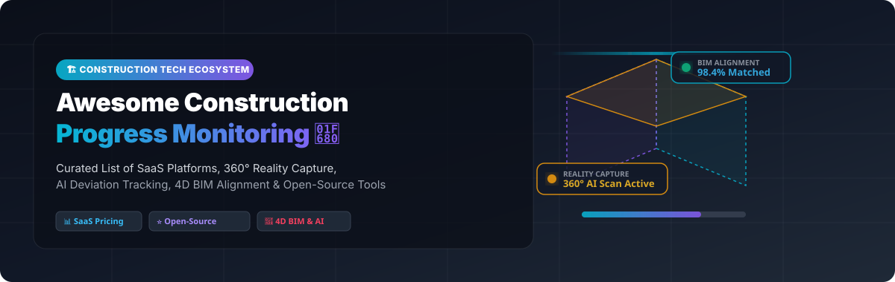

  
  
  
  
  

  

# 🏗️ Awesome Construction Progress Monitoring

> **Curated List of SaaS Platforms, AI Reality Capture Tools, 4D BIM Solutions & Open-Source Projects for Construction Site Tracking.**

---

## 📋 Meta Description & Overview
**Construction Progress Monitoring** leverages 360° reality capture, photogrammetry, computer vision, laser scanning, and Building Information Modeling (BIM) to track work-in-place, audit schedules, detect element-level installation deviations, and automate Earned Value Management (EVM).

This repository serves as a comprehensive, SEO-optimized directory of commercial SaaS products and open-source libraries enabling digital twin site verification for general contractors, owner-operators, VDC engineers, and trade specialists.

---

## 📚 Table of Contents
- [🏢 SaaS & Hosted Platforms](#-saas--hosted-platforms)
- [💻 Open-Source GitHub Projects](#-open-source-github-projects)
- [🤝 How to Contribute](#-how-to-contribute)
- [⚖️ Disclaimer](#%EF%B8%8F-disclaimer)
- [📈 Star History](#-star-history)
- [☕ Support & Sponsorship](#-support--sponsorship)

---

## 🏢 SaaS & Hosted Platforms

> 💡 **Market Overview & Insights**: The global Construction Progress Monitoring & Reality Capture market is valued at **~$5.35 Billion** (projected to reach **>$10 Billion by 2033**). The sector is **highly fragmented**, comprising specialized AI computer vision startups, crane IoT sensors, helmet-mounted cameras, and 4D BIM platforms rather than a single winner-take-all monopoly.

Below is a curated comparison of leading SaaS products, **sorted by estimated company valuation / size (descending)**:

| 🏢 Platform | 📝 Description & Key Capabilities | 💰 Estimated Company Size / Valuation | 🏷️ Starting Pricing | 🎁 Free Tier / Free Trial Limits |
| :--- | :--- | :--- | :--- | :--- |
| **[Buildots](https://buildots.com/)** | 🤖 AI-powered site progress tracking using 360° cameras & laser scans aligned to BIM & Primavera P6 schedules. Features automated delay forecasting & element-level tracking. | **~$1.0 Billion** ($297M Total Funding, $130M Series C/D) | Starts at **$2,500 / month** per project site ($30,000 / year base) | **14-day sales-assisted trial** (limited to 1 sample project walkthrough) |
| **[OpenSpace](https://www.openspace.ai/)** | 📸 Global leader in 360° reality capture & AI analytics (**OpenSpace Track**). Captures 25,000 sq ft in 10 mins with 700+ visual component tracking. Acquired Disperse. | **~$913 Million** ($200M Total Funding, Series D) | Starts at **$500 / user / month** ($6,000 / year capture license) | **14-day interactive demo trial** (limited to 1 sample capture dataset) |
| **[Versatile](https://versatile.ai/)** | 🏗️ AI-powered crane IoT hook sensor (**CraneView**) logging as-installed structural steel & concrete lifts, cycle times, and crane idle reduction. | **~$300 Million** ($108M Total Funding, Series B) | Starts at **$5,000 / month** per crane installation | **30-day single-crane pilot trial** (limited to 1 crane hook deployment) |
| **[Doxel](https://doxel.ai/)** | 🏭 AI progress tracking specialized for data center & heavy commercial construction using computer vision & Insta360 jobsite capture. | **~$250 Million** ($59M Total Funding, Series B) | Starts at **$3,000 / month** per active jobsite | **30-day proof-of-concept trial** (limited to 1 jobsite location) |
| **[Avvir](https://avvir.ai/)** | 📐 Automated construction monitoring creating 4D BIM digital twins via LiDAR scans & DroneDeploy 360 walkthrough integration. | **~$100 Million** (Acquired by Hexagon AB, $20B+ Cap) | Starts at **$1,500 / month** per active building scan | **14-day sandbox trial** (limited to 1 BIM model upload limit) |
| **[Disperse](https://www.disperse.io/)** | 🔍 Milestone-based visual tracking combining AI with human architect verification for non-conformance & delay detection. Now part of OpenSpace. | **~$100 Million** (Acquired by OpenSpace) | Starts at **$1,200 / month** per site deployment | **14-day project assessment trial** (limited to 1 floor scan) |
| **[Reconstruct](https://reconstructinc.com/)** | 📱 Remote QC platform generating as-built digital twins with 2D floor plans, 3D photogrammetry & 4D BIM schedule sequencing. | **~$75 Million** ($17.3M Total Funding, Series B) | Starts at **$299 / month** per project user | **14-day full feature trial** (limited to 5,000 sq ft & 1 project) |
| **[WakeCap](https://www.wakecap.com/)** | 👷 Wearable helmet sensor & 360° camera network tracking site workforce productivity, location, and P6 Earned Value Management (EVM). | **~$60 Million** ($26M Total Funding, Series A) | Starts at **$10 / worker / month** ($1,000 / month base minimum) | **30-day field trial** (limited to 20 worker safety helmet units) |

---

## 💻 Open-Source GitHub Projects

While full enterprise progress platforms require complex cloud & AI infrastructure, high-impact **open-source tools, photogrammetry engines, and BIM processing frameworks** exist. 

The open-source projects below are **sorted by GitHub Star Count (descending)**, with direct links to each repository's stargazers page:

1. **[Open3D](https://github.com/isl-org/Open3D)**   
   🌐 *3D Data Processing Engine*: Open-source library for 3D data processing, point cloud registration, surface reconstruction, and alignment against BIM reference meshes.

2. **[COLMAP](https://github.com/colmap/colmap)**   
   📸 *Structure-from-Motion & Multi-View Stereo*: General-purpose photogrammetry pipeline converting drone & smartphone construction site imagery into accurate dense 3D point clouds.

3. **[OpenMVG](https://github.com/openMVG/openMVG)**   
   🧩 *Multiple View Geometry*: C++ framework providing Structure-from-Motion algorithms for spatial site geometry reconstruction.

4. **[OpenDroneMap (ODM)](https://github.com/OpenDroneMap/ODM)**   
   🛸 *Drone Aerial Photogrammetry*: Open-source ecosystem for processing aerial drone imagery into orthophotos, point clouds, and elevation models for earthwork & site progress tracking.

5. **[Potree](https://github.com/potree/potree)**   
   🖥️ *Web-Based Point Cloud Viewer*: WebGL point cloud renderer capable of visualizing multi-gigabyte laser scans & drone scans directly in web browsers for site comparison.

6. **[CloudCompare](https://github.com/CloudCompare/CloudCompare)**   
   ☁️ *3D Point Cloud & Mesh Comparison*: Open-source 3D point cloud processing software featuring direct distance cloud-to-cloud comparison to detect structural deviations between BIM and laser scans.

7. **[IfcOpenShell](https://github.com/IfcOpenShell/IfcOpenShell)**   
   🏛️ *Open IFC BIM Parser*: Python/C++ open BIM library for parsing, analyzing, and modifying Industry Foundation Classes (IFC) files for progress vs planned element matching.

8. **[xeokit-sdk](https://github.com/xeokit/xeokit-sdk)**   
   👓 *3D Web BIM & Laser Scan Viewer*: Browser SDK for rendering high-precision 3D BIM models and point cloud scans with color-coded status overlays.

9. **[Speckle Server](https://github.com/specklesystems/speckle-server)**   
   🔄 *Open AEC Data Platform*: Open-source framework for extracting, versioning, and syncing geometry & metadata across CAD, BIM (Revit, IFC), and custom progress web apps.

10. **[Sandwich Panel Installation Tracker](https://github.com/KonevOleg/sandwich-panel-tracker)**   
    📐 *AutoCAD Production Plugin*: Production-deployed AutoCAD plugin for tracking sandwich panel installations in real-time. Reduced weekly reporting from 4 hours to 10 seconds on a 5,000-panel project.

11. **[P6 Extraction Framework](https://github.com/bededani22-art/p6-extraction-framework)**   
    📅 *Primavera P6 Digital Twin Sync*: Schedule extraction toolkit (Python, VBA, SQL) to sync Primavera P6 schedule data with 4D BIM progress models.

---

## 🛠️ Recommended Open-Source Architecture Blueprint
To build a custom, low-cost construction progress monitoring platform:
1. **Photogrammetry & Point Cloud Generation**: Use **OpenDroneMap (ODM)** or **COLMAP**.
2. **Point Cloud Alignment & As-Built Analysis**: Use **CloudCompare** and **Open3D**.
3. **BIM Model Parsing & Schema Extraction**: Use **IfcOpenShell** and **Speckle Server**.
4. **Web 3D Visualization**: Combine **Potree** (point clouds) and **xeokit-sdk** (IFC BIM).
5. **Schedule Synchronization**: Use **P6 Extraction Framework** linked to **PostgreSQL**.

---

## 🤝 How to Contribute

Contributions are highly welcome! To add a new platform or open-source tool:

1. 🍴 **Fork** this repository.
2. 📝 Edit `README.md` keeping formatting & tabular structures consistent.
3. 🔗 Include factual platform links, specific pricing, free trial details, and star badges.
4. 🚀 Submit a **Pull Request (PR)** with a summary of changes.

---

## ⚖️ Disclaimer

- This directory is **community-curated** for educational & architectural reference — not an official endorsement.
- Construction progress platforms collect sensitive project geometry and field workforce data; ensure contractual compliance, SOC 2 / ISO security certification, and data privacy regulations.
- Re-check vendor pricing directly on official websites as enterprise subscription tiers evolve.

---

## 📈 Star History

---

## ☕ Support & Sponsorship

If you find this repository helpful for your construction engineering projects, research, or software development, consider supporting the work:

- ⭐ **Star** this repository to increase visibility!
- 🔀 **Fork** and share with your AEC & VDC engineering network!
- 💖 **Sponsor / Buy me a coffee**: Support ongoing open-source curation via the [GitHub Sponsor Dashboard](https://github.com/sponsors/ishandutta2007).

---

  <b>Built for Construction Project Managers, VDC Engineers, Field Superintendents, and AEC Developers.</b> 
  Let's make construction progress monitoring transparent, automated, and verifiable! 🏗️🚀

